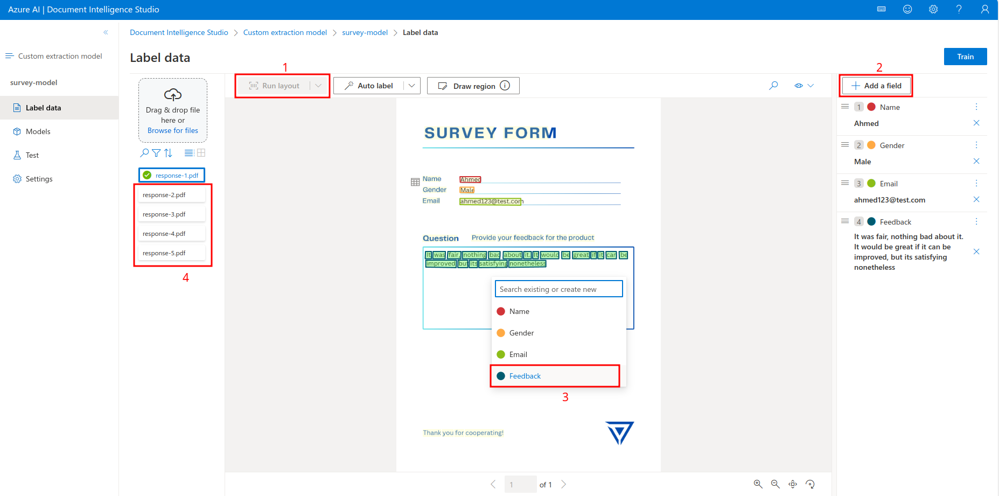

# Survey Analyzer
A quick demo web application using Azure's AI services (Document Intelligence and Language for Sentiment Analysis) that takes a specific feedback template (whether by PDF or image), extracts text into fields such as name, gender, email, and feedback using a custom Document Intelligence model then applies sentiment analysis on a survey's feedback

Technologies used: React, Flask, Docker, Terraform, and Azure

- [Getting Started](#getting-started)
    - [Steps](#steps)
        - [Local](#local)
        - [Azure VM](#azure-vm)
        - [Document Intelligence Model Training](#document-intelligence-model-training)
        - [Testing](#testing)
- [Wrap Up](#wrap-up)


# Getting Started
- Make sure the following are installed
    - Docker
    - Docker Compose
    - Terraform
    - Azure CLI
- Login with your Azure account `az login`

## Steps
The default setup deploys the application to an Azure virtual machine with an Nginx web server configured with SSL automatically. If you'll use the app locally you won't need to deploy a virtual machine, follow the steps below and choose either the Local steps or Azure VM steps

### Local
- Rename `virtual-machine.tf` to `virtual-machine.tf.disable`
- Comment `vm_dns_name` and `vm_public_ip` code blocks in the `outputs.tf` terraform file
- Deploy the infrastructure `terraform apply`
- Follow the Document Intelligence Model Training [steps](#document-intelligence-model-training) below
    - If you named the model something else than survey-model, be sure to change `DOCUMENT_INTELLIGENCE_MODEL_ID` accordingly in the `env-files-setup.sh` script
- Update the `.env` files using `modify-env-vars.sh` script which takes Terraform outputs and adds them in the `.env` file of both Frontend and Backend
- Deploy the app `docker compose build && docker compose up`
- Go to http://localhost:3000 and upload a survey

### Azure VM
- Deploy the infrastructure `terraform apply -var public_key_path=~/.ssh/key-name.pub`
- Follow the Document Intelligence Model Training [steps](#document-intelligence-model-training) below
- Update the `.env` files using `modify-env-vars.sh` script which takes Terraform outputs and adds them in the `.env` file of both Frontend and Backend
- In the repo directory, copy the `docker-compose.yml` file and `backend` and `frontend` directories to the server
    ```
    # You can get the public IP of the VM whether from Azure or using the command below
    terraform output -state $(readlink -f $(dirname .))/terraform/terraform.tfstate -raw vm_public_ip

    # You may need to include path to private key
    scp -r docker-compose.yml backend/ frontend/ ubuntu@$public_ip:.
    ```
- `ssh ubuntu@$vm_public_ip` then `docker compose build && docker compose up -d` to deploy the app
- In Azure portal, find the DNS name in the VM, put it in the browser and upload a survey
    - Alternatively you can execute `terraform output -state $(readlink -f $(dirname .))/terraform/terraform.tfstate -raw vm_dns_name` to get the DNS


### Document Intelligence Model Training
1. Go to Azure's Document Intelligence [studio](https://documentintelligence.ai.azure.com/) and create a new project

    
    
2. You can name the project anything you like, make sure to target the correct resource group, storage account and blob container like shown below

    
3. Run layout to scan all the available text, and create 4 fields, then highlight each text and add it to the correct field
    - Note: keys such as `Feedback` are case sensitive, the app won't work if its written `feedback` instead

    
4. Repeat on the rest of the PDFs then finally click Train on the top right corner to train the model, be sure to name it `survey-model`
    - Note: you can name the model anything else you like, just be sure to change `MODEL_ID` accordingly in the backend's `.env` file

    

### Testing
After the app has been successfully deployed, you can use the survey forms in the terraform directory or create your own by using [this](https://www.canva.com/design/DAGGz2NOQQM/UUFC14RL2JPjUSaPJjuw3A/view?utm_content=DAGGz2NOQQM&utm_campaign=designshare&utm_medium=link&utm_source=publishsharelink&mode=preview) template (Canva account will be needed to edit)
Upload the custom survey file then click on analyze and you're done
    

# Wrap Up
Be sure to not forget to destroy your Terraform resources after you're done. If you have any feedback or any issue don't hesitate to let me know!